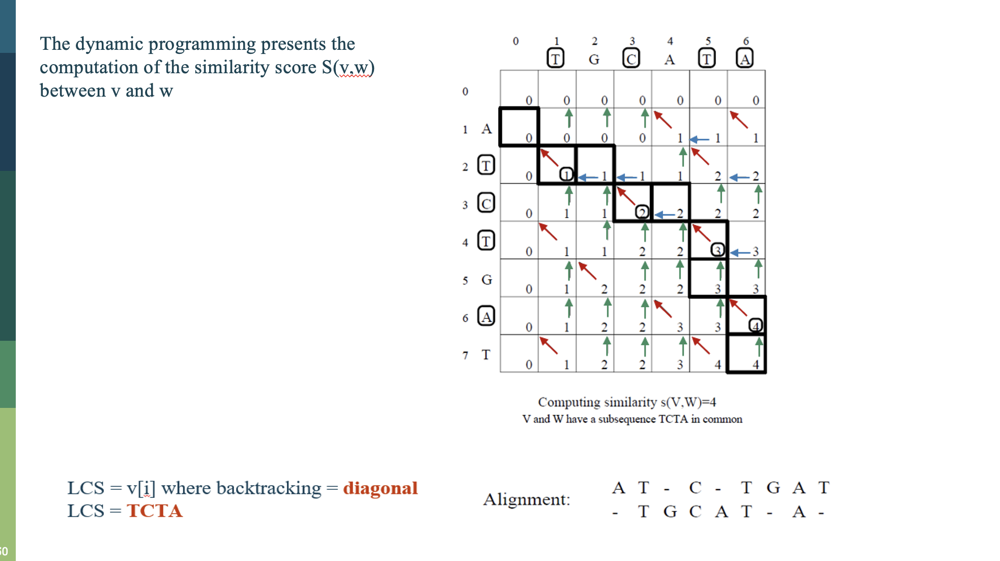
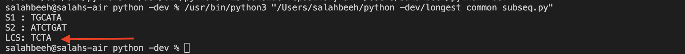

# Longest Common Subsequance 
The longest common subsequence **(LCS)** is defined as the longest subsequence that is common to all the given sequences, provided that the elements of the subsequence are not required to occupy consecutive positions within the original sequences.

In this repo I'm trying to slove the following problem of pairwise sequance alignment using dynamic programming approch.


## Why does dynamic programming algorithm more efficient than the recursive algorithm solving an LCS problem?

- The method of dynamic programming reduces the number of function calls. It stores the result of each function call so that it can be used in future calls without the need for redundant calls.

- In the below dynamic algorithm, the results obtained from each comparison between elements of S1 and the elements of S2 are stored in a table so that they can be used in future computations.

- The most important reason I beleive is the time complexity of the Dynamic programming is a way better than the recursion one as the time to fill the tabel is O(mn) as m is the length of S1 and n is the length of S2

```
S1 and S2 be two given sequences
Initialize a table LCS of dimension S1.length * S2.length
S1.label = S1
S2.label = S2
LCS[0][] = 0
LCS[][0] = 0
Start from LCS[1][1]
Compare S1[i] and S2[j]
    If S1[i] = S2[j]
        LCS[i][j] = 1 + LCS[i-1, j-1]   
        Point an arrow to LCS[i][j]
    Else
        LCS[i][j] = max(LCS[i-1][j], LCS[i][j-1])
        Point an arrow to max(LCS[i-1][j], LCS[i][j-1])
```

## Output 
here is what the output look like, my code output should've draw a map between the sequances but I failed to do it for now, I'll update it once I have the drawing function working.

